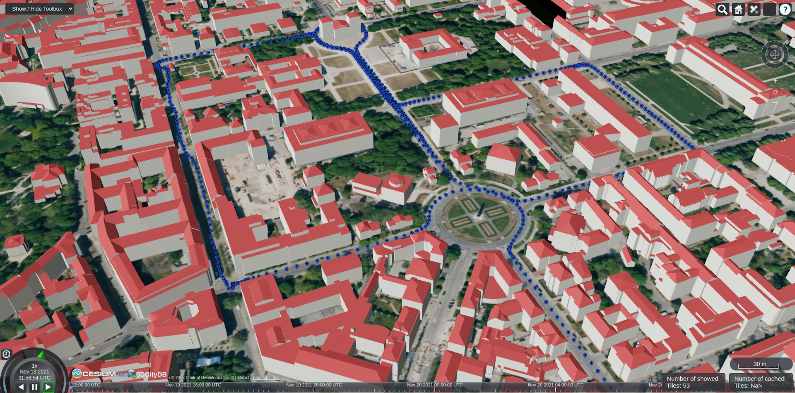
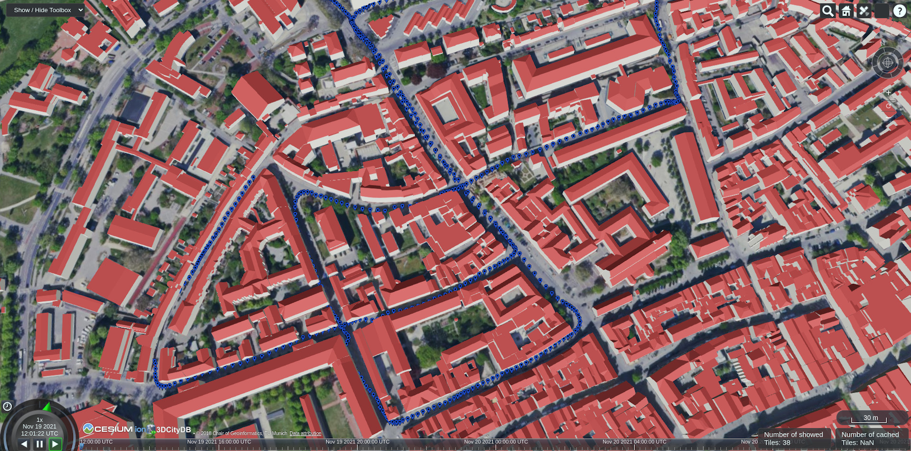
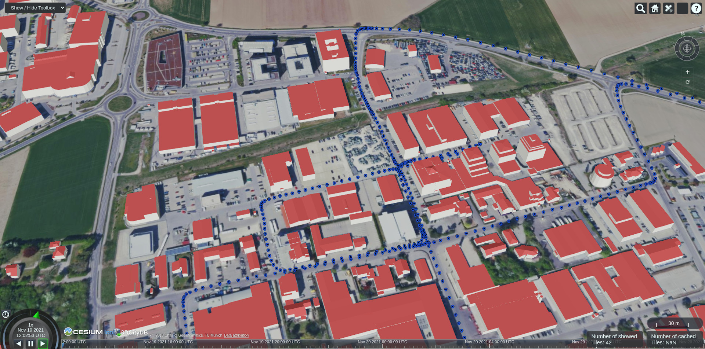

============
A2D2 Dataset
============

The `Audi Autonomous Driving Dataset (A2D2)`_ contains sensor data of an Audi Q7 e-tron for three test drives.
A comprehensive description can be found in the `A2D2 paper`_ released by the Audi team.

.. _Audi Autonomous Driving Dataset (A2D2): https://www.a2d2.audi
.. _A2D2 paper: https://arxiv.org/abs/2004.06320

Sensor Setup
============

The sensor setup is described in more detail on the `A2D2 page`_.

.. _A2D2 page: https://www.a2d2.audi/a2d2/en/sensor-setup.html

.. figure:: https://www.a2d2.audi/content/dam/a2d2/sensor-setup/1920x1080-desktop-aev-sensor-grafik-1.jpg
  :alt: A2D2 Sensor Setup (top view)
  :target: https://www.a2d2.audi/a2d2/en/sensor-setup.html
  :class: with-shadow

  Top view of sensor setup for the A2D2 dataset (src: `www.a2d2.audi <https://www.a2d2.audi/a2d2/en/sensor-setup.html>`_)

======  ============  ==================
Sensor    Location           Type
======  ============  ==================
Camera  Front-center  Sekonix-SF3325-100
Camera  Front-left    Sekonix-SF3324-100
Camera  Front-right   Sekonix-SF3324-100
Camera  Side-left     Sekonix-SF3324-100
Camera  Side-right    Sekonix-SF3324-100
Camera  Rear-center   Sekonix-SF3324-100
LiDAR   Front-center  Velodyne-VLP-16
LiDAR   Front-left    Velodyne-VLP-16
LiDAR   Front-right   Velodyne-VLP-16
LiDAR   Rear-left     Velodyne-VLP-16
LiDAR   Rear-right    Velodyne-VLP-16
======  ============  ==================

Driving Areas
=============

The GPS trajectories of the A2D2 datasets are visualized with a virtual globe using the `3DCityDB-Web-Map-Client`_.
Open them by clicking on the images (Chrome is recommended).

.. _3DCityDB-Web-Map-Client: https://github.com/3dcitydb/3dcitydb-web-map

Munich
^^^^^^

3Dbuildings%26ld%3DCesium%25203D%2520Tiles%26lp%3D%26lc%3D%26gv%3D%26a%3Dtrue%26tdu%3Dhttps%253A%252F%252Fbsvr.gis.lrg.tum.de%252Fpostgrest%252Fgeomassendaten%26ds%3DPostgreSQL%26tt%3DHorizontal%26gc%3D%26il%3D%26al%3D%26ac%3D%26av%3D&l_1=u%3Dhttps%253A%252F%252Fwww.3dcitydb.org%252F3dcitydb%252Ffileadmin%252Fpublic%252F3dwebclientprojects%252Ftrajectories%252Fkml_trajectories_munich%252Fkml_trajectories_munich1_geometry_MasterJSON.json%26n%3Dtrajectories%26ld%3DCOLLADA%252FKML%252FglTF%26lp%3Dfalse%26lc%3Dfalse%26gv%3D2.0%26a%3Dtrue%26tdu%3D%26ds%3DPostgreSQL%26tt%3DHorizontal%26gc%3D%26il%3D125%26al%3D1.7976931348623157e%252B308%26ac%3D50%26av%3D200&bm=name%3Ddop80%26iconUrl%3D%26tooltip%3D%26url%3Dhttps%253A%252F%252Fgeoservices.bayern.de%252Fwms%252Fv2%252Fogc_dop80_oa.cgi%253F%26layers%3Dby_dop80c%26additionalParameters%3D%26proxyUrl%3D%252Fproxy%252F&tr=name%3Ddgm%26iconUrl%3D%26tooltip%3D%26url%3Dhttps%253A%252F%252Fbvv3d21.bayernwolke.de%252F3d-data%252Flatest%252Fterrain%252F&sw=

  A2D2 trajectory of Munich

Ingolstadt
^^^^^^^^^^

n%3Dbuildings%26ld%3DCesium%25203D%2520Tiles%26lp%3D%26lc%3D%26gv%3D%26a%3Dtrue%26tdu%3Dhttps%253A%252F%252Fbsvr.gis.lrg.tum.de%252Fpostgrest%252Fgeomassendaten%26ds%3DPostgreSQL%26tt%3DHorizontal%26gc%3D%26il%3D%26al%3D%26ac%3D%26av%3D&l_1=u%3Dhttps%253A%252F%252Fwww.3dcitydb.org%252F3dcitydb%252Ffileadmin%252Fpublic%252F3dwebclientprojects%252Ftrajectories%252Fkml_trajectories_ingolstadt%252Fkml_trajectories_ingolstadt_geometry_MasterJSON.json%26n%3Dtrajectories_ingolstadt%26ld%3DCOLLADA%252FKML%252FglTF%26lp%3Dfalse%26lc%3Dfalse%26gv%3D2.0%26a%3Dtrue%26tdu%3D%26ds%3DPostgreSQL%26tt%3DHorizontal%26gc%3D%26il%3D125%26al%3D1.7976931348623157e%252B308%26ac%3D50%26av%3D200&bm=name%3Ddop80%26iconUrl%3D%26tooltip%3D%26url%3Dhttps%253A%252F%252Fgeoservices.bayern.de%252Fwms%252Fv2%252Fogc_dop80_oa.cgi%253F%26layers%3Dby_dop80c%26additionalParameters%3D%26proxyUrl%3D%252Fproxy%252F&tr=name%3Ddgm%26iconUrl%3D%26tooltip%3D%26url%3Dhttps%253A%252F%252Fbvv3d21.bayernwolke.de%252F3d-data%252Flatest%252Fterrain%252F&sw=showOnStart%3Dfalse

  A2D2 trajectory of Ingolstadt

Gaimersheim
^^^^^^^^^^^

n%3Dbuildings%26ld%3DCesium%25203D%2520Tiles%26lp%3D%26lc%3D%26gv%3D%26a%3Dtrue%26tdu%3Dhttps%253A%252F%252Fbsvr.gis.lrg.tum.de%252Fpostgrest%252Fgeomassendaten%26ds%3DPostgreSQL%26tt%3DHorizontal%26gc%3D%26il%3D%26al%3D%26ac%3D%26av%3D&l_1=u%3Dhttps%253A%252F%252Fwww.3dcitydb.org%252F3dcitydb%252Ffileadmin%252Fpublic%252F3dwebclientprojects%252Ftrajectories%252Fkml_trajcetories_gaimersheim%252Fkml_trajectories_gaimersheim_geometry_MasterJSON.json%26n%3Dtrajectories_gaimersheim%26ld%3DCOLLADA%252FKML%252FglTF%26lp%3Dfalse%26lc%3Dfalse%26gv%3D2.0%26a%3Dtrue%26tdu%3D%26ds%3DPostgreSQL%26tt%3DHorizontal%26gc%3D%26il%3D125%26al%3D1.7976931348623157e%252B308%26ac%3D50%26av%3D200&bm=name%3Ddop80%26iconUrl%3D%26tooltip%3D%26url%3Dhttps%253A%252F%252Fgeoservices.bayern.de%252Fwms%252Fv2%252Fogc_dop80_oa.cgi%253F%26layers%3Dby_dop80c%26additionalParameters%3D%26proxyUrl%3D%252Fproxy%252F&tr=name%3Ddgm%26iconUrl%3D%26tooltip%3D%26url%3Dhttps%253A%252F%252Fbvv3d21.bayernwolke.de%252F3d-data%252Flatest%252Fterrain%252F&sw=showOnStart%3Dfalse

  A2D2 trajectory of Gaimersheim
