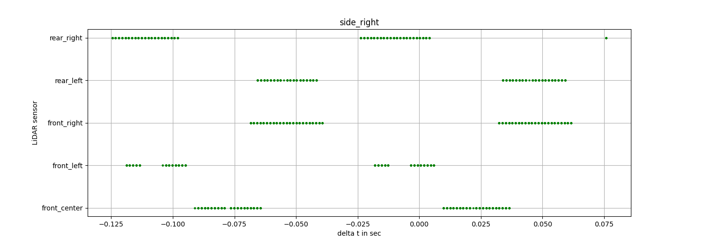
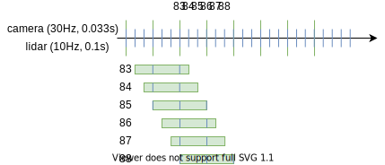

===================
Dataset Preparation
===================

The A2D2 dataset is provided in a way that makes it very straightforward to apply the LiDAR data to the images,
for example projecting a point cloud directly into the image plane. Therefore, each image file is accompanied
by a point cloud file of the corresponding view.

Our objective was to restore the original sensor information as close as possible and then use this excellent
A2D2 dataset for `Cartographer`_'s SLAM.

.. _Cartographer: https://github.com/cartographer-project/cartographer

Point Cloud to Camera View Mapping
==================================

In the A2D2 dataset, the laser point clouds of the LiDAR sensors are mapped to the camera views.
Thus, a single point cloud file contains reflections of multiple LiDAR sensors.

There are six cameras on the vehicle with the following directions:
`front_center`, `front_left`, `front_right`, `side_left`, `side_right` and `rear_center`.
Despite the fact that only five LiDAR sensors are installed, six LiDAR datasets (for each view) can be downloaded.

To obtain the point clouds from each individual LiDAR sensor, they are mapped back by A2D2 ROS Preparer.

Time Progression between Different Views
========================================

Every next time step is represented by an ascending ID in the file name.

However, the IDs do not match in regard to time across the views.
For example, in the preview dataset, the point cloud file of `front_center` with ID 83 contains completely different
reflection timestamps than the point cloud file ID 83 of `rear_center`.
Thus, `front_center` starts with ID 83 and  `rear_center` with ID 60, while describing an equal time interval.

Consequently, the IDs are irrelevant for the rosbag to be generated, whereas the time synchronization between the
sensors are very important.

Sensor Speeds
=============

The cameras are running at 30Hz (0.033s duration) and the LiDAR sensors at 10Hz (0.1s duration).
The following image shows the point reflection times of the file `20180810150607_lidar_sideright_000000060.npz`
separated by LiDAR sensor:

One recognizes the revolution duration of 0.1s and notes that a single file contains two revolutions.
The point positions over the two revolutions were thus compensated by the vehicle's motion (0.1s*30km/h = 83.33cm)
to match the image data.

As each LiDAR file contains reflections within a timespan of 0.2s and the files are provided according to the
camera speed (30Hz), the points between consecutive files overlap:

This leads to point duplicates (same timestamp, different position due to vehicle ego-motion compensation),
which are removed by A2D2 ROS Preparer for the generation of the rosbag.

Timestamp Types
===============

The A2D2 dataset comprises two types of timestamps: the time master and the GNSS receiver times.
A detailed description can be read under the section 'Sensor Synchronization' on the `A2D2 page`_.

* LiDAR files (.npz): `timestamp` field denotes GNSS time, `rectime` field denotes the master time
* Camera meta information (.json): `cam_tstamp` field denotes the master time
* Bus signal file (.json): `time` denotes the master time

However, there is a constant offset between the two-time types, which is identified and subtracted out,
when generating the rosbag.

.. _A2D2 page: https://www.a2d2.audi/a2d2/en/sensor-setup.html
